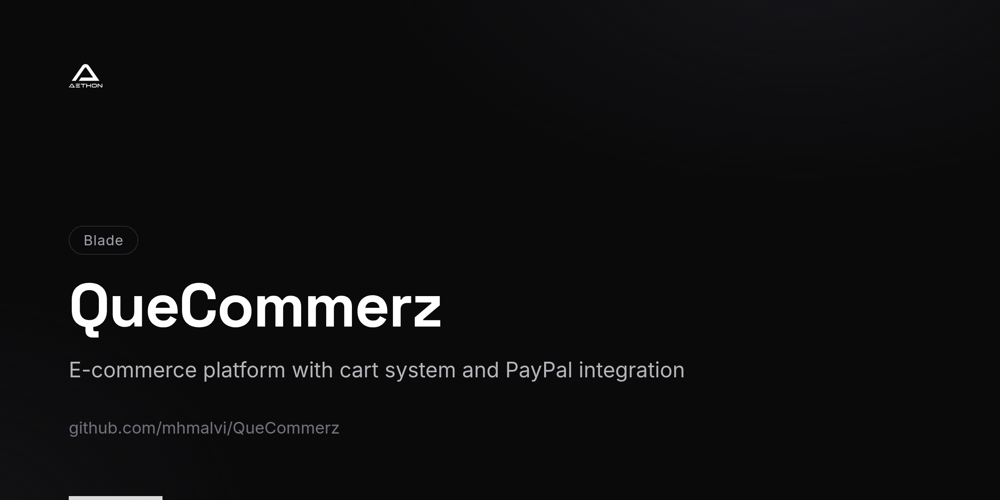

<!-- repo-card -->


# QueCommerz

A modern e-commerce platform built with Laravel 8 featuring a clean storefront, shopping cart with session management, PayPal payment integration, wishlist functionality, and order tracking with invoice generation.

## Features

- **Product Catalog** — Browse and search products with category-based filtering
- **Custom Cart System** — Session-based cart with trait-driven architecture (`TCart`) for flexible item management
- **PayPal Integration** — Secure payment processing through PayPal gateway
- **Wishlist** — Authenticated users can save products for future purchase
- **Order Tracking** — Track order status and view detailed invoices by order number
- **Recently Viewed** — Automatic tracking of recently viewed products for personalized browsing
- **User Dashboard** — Account management with profile editing and password changes
- **Checkout Flow** — Streamlined checkout process with address collection and payment method selection
- **Responsive Storefront** — Customer-facing pages including About Us and Contact Us
- **Authentication** — Laravel Breeze-powered registration, login, and email verification

## Tech Stack

| Component | Technology |
|-----------|------------|
| Framework | Laravel 8 |
| Language | PHP 7.3+ / 8.0 |
| Frontend | Blade Templates |
| Authentication | Laravel Breeze |
| Payments | PayPal |
| Database | MySQL |
| ORM | Eloquent |

## Prerequisites

- PHP 7.3+ or 8.0
- Composer
- MySQL 5.7+
- Node.js (for asset compilation)

## Getting Started

### 1. Clone the Repository

```bash
git clone https://github.com/mhmalvi/QueCommerz.git
cd QueCommerz
```

### 2. Install Dependencies

```bash
composer install
npm install && npm run dev
```

### 3. Configure Environment

```bash
cp .env.example .env
php artisan key:generate
```

Edit `.env` with your database and PayPal credentials:

```env
DB_CONNECTION=mysql
DB_HOST=127.0.0.1
DB_DATABASE=quecommerz
DB_USERNAME=root
DB_PASSWORD=

PAYPAL_CLIENT_ID=your_paypal_client_id
PAYPAL_SECRET=your_paypal_secret
```

### 4. Run Migrations

```bash
php artisan migrate --seed
```

### 5. Start the Server

```bash
php artisan serve
```

The application will be available at `http://localhost:8000`.

## Key Routes

### Storefront

| Route | Description |
|-------|-------------|
| `/` | Homepage |
| `/shop` | Product catalog |
| `/view/{product}` | Product detail page |
| `/shop/{category}` | Products by category |
| `/cart` | Shopping cart |
| `/checkout` | Checkout page |
| `/wishlist` | User wishlist |
| `/track-my-order` | Order tracking |
| `/about-us` | About page |
| `/contact-us` | Contact page |

### User Account

| Route | Description |
|-------|-------------|
| `/dashboard` | User dashboard |
| `/profile` | Profile management |
| `/change-password` | Password update |
| `/track-orders` | Order history |
| `/track-orders/view/{order_no}` | Invoice view |

### Cart API

| Method | Route | Description |
|--------|-------|-------------|
| POST | `/{product}/add-to-cart` | Add item to cart |
| PUT | `/update-cart` | Update cart |
| PUT | `/update-cart-item` | Update single item quantity |
| DELETE | `/remove/{product}` | Remove item from cart |
| GET | `/mini-cart` | Get mini cart summary |

## Architecture Highlights

- **Cart Trait System** — The cart is implemented using `TCart` trait and `ICart` interface for a clean, reusable cart abstraction
- **Resource Collections** — API responses use Laravel Resource Collections (`MiniCartCollection`, `OrdersCollection`, `ProductsCollection`)
- **Recently Viewed** — Custom `RecentlyViewed` service tracks browsing history per session
- **Middleware Guards** — `RedirectIfHasCart` middleware manages cart-dependent checkout flow

## Project Structure

```
QueCommerz/
├── app/
│   ├── Http/
│   │   ├── Cart/                 # Cart system (Cart, ICart, Item, TCart)
│   │   ├── Controllers/         # Application controllers
│   │   ├── Middleware/           # Custom middleware
│   │   ├── RecentView/          # Recently viewed products service
│   │   ├── Requests/            # Form request validation
│   │   └── Resources/           # API resource collections
│   └── Models/                  # Eloquent models
├── database/migrations/         # Database schema
├── resources/views/             # Blade templates
├── routes/web.php               # Web routes
└── composer.json
```

## License

This project is open source and available under the [MIT License](LICENSE).
